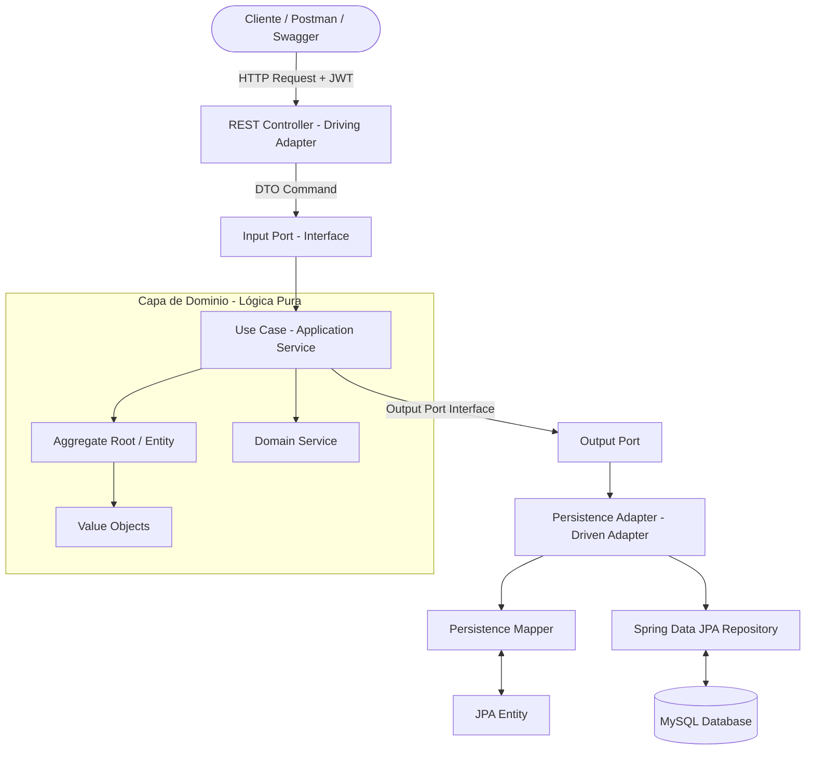

# 🛒 Nexus_MarketPlace — Arquitectura & Análisis del Proyecto Base

> **Documento de Análisis de Arquitectura Base (DDD + Hexagonal) y Especificación Técnica para la API de Nexus_MarketPlace.**

---

## 📑 Tabla de Contenido

1. [Resumen Ejecutivo y Contexto](#1-resumen-ejecutivo-y-contexto)
2. [Stack Tecnológico del Proyecto Base](#2-stack-tecnológico-del-proyecto-base)
3. [Módulo de Autenticación, Seguridad y Roles (Login & JWT)](#3-módulo-de-autenticación-seguridad-y-roles-login--jwt)
4. [Estrategia de Conexión a Base de Datos y Persistencia](#4-estrategia-de-conexión-a-base-de-datos-y-persistencia)
5. [Estructura del Proyecto Base (Arquitectura Hexagonal + DDD)](#5-estructura-del-proyecto-base-arquitectura-hexagonal--ddd)
6. [Flujo de Operación y Funcionalidades Clave del Proyecto Base](#6-flujo-de-operación-y-funcionalidades-clave-del-proyecto-base)
7. [Manejo de Errores y Respuesta Estandarizada](#7-manejo-de-errores-y-respuesta-estandarizada)
8. [Adaptación Arquitectónica para Nexus_MarketPlace](#8-adaptación-arquitectónica-para-nexus_marketplace)
9. [Próximos Pasos para la Construcción de Nexus_MarketPlace](#9-próximos-pasos-para-la-construcción-de-nexus_marketplace)

---

## 1. Resumen Ejecutivo y Contexto

El proyecto base analizado (`CSoftware2SantiagoMacias-develop`) es un **Sistema de Gestión Bancaria** diseñado bajo los principios de **Arquitectura Hexagonal (Puertos y Adaptadores)** y **Diseño Guiado por el Dominio (Domain-Driven Design - DDD)** sobre el ecosistema **Java 17** y **Spring Boot**.

### Objetivos del Análisis:
- **Extraer el modelo arquitectónico**: Aislar la lógica de negocio pura del framework y los mecanismos de persistencia.
- **Entender el mecanismo de seguridad y autenticación**: Identificar cómo se gestionan el Login, los Tokens JWT, la autorización basada en roles (RBAC) y la propagación del contexto de seguridad.
- **Revisar la persistencia desacoplada**: Comprender cómo interactúan las entidades de dominio, los Value Objects, los mappers, las entidades JPA y los repositorios Spring Data.
- **Establecer las bases para Nexus_MarketPlace**: Trasladar este estándar arquitectónico de alto nivel al dominio de un **Marketplace Centralizado** (gestión de compradores, vendedores, catálogo, inventario distribuido multi-bodega, procesamiento de órdenes, facturación y logística post-venta).

---

## 2. Stack Tecnológico del Proyecto Base

El proyecto base está configurado con las siguientes tecnologías y librerías en su `pom.xml`:

| Componente | Tecnología / Librería | Versión / Detalle | Propósito |
|---|---|---|---|
| **Lenguaje** | Java OpenJDK | 17 LTS | Plataforma de ejecución principal. |
| **Framework Core** | Spring Boot | 3.x / 4.x Starter Parent | Núcleo de inyección de dependencias y configuración. |
| **Web REST** | `spring-boot-starter-web` | Incluida con Spring Boot | Creación de controladores REST, JSON serialization vía Jackson. |
| **Persistencia** | `spring-boot-starter-data-jpa` + Hibernate | JPA 3.x / Hibernate 6.x | Manejo ORM para bases de datos relacionales. |
| **Base de Datos Principal** | MySQL Connector/J (`mysql-connector-j`) | Runtime Scope | Conexión con motor MySQL (`jdbc:mysql://localhost:3306/bankdb`). |
| **Base de Datos de Soporte** | SQLite JDBC (`sqlite-jdbc`) / H2 Console | 3.46.0.0 | Soporte para pruebas locales, migraciones y consola embebida. |
| **Seguridad** | `spring-boot-starter-security` | Spring Security 6.x | Control de acceso HTTP, filtros de seguridad y encriptación. |
| **Tokens de Autenticación** | `io.jsonwebtoken:jjwt-api`, `jjwt-impl`, `jjwt-jackson` | 0.12.5 | Generación, firma criptográfica (HMAC-SHA256) y validación de tokens JWT. |
| **Validaciones** | `spring-boot-starter-validation` | Jakarta Validation / Hibernate Validator | Validaciones declarativas en DTOs (`@NotNull`, `@NotBlank`, `@DecimalMin`, `@Email`). |
| **Documentación OpenAPI** | `springdoc-openapi-starter-webmvc-ui` | 2.8.8 | Generación automática de Swagger UI (`/swagger-ui.html`) y OpenAPI 3 (`/v3/api-docs`). |
| **Serialización Fechas** | `jackson-datatype-jsr310` | 2.17.2 | Soporte para tipos `java.time.*` (`LocalDate`, `LocalDateTime`) en JSON. |
| **Tareas Programadas** | Spring Scheduler (`@EnableScheduling`, `@Scheduled`) | Nativo de Spring Boot | Expiración automática periódica de transacciones pendientes. |

---

## 3. Módulo de Autenticación, Seguridad y Roles (Login & JWT)

### ¿Tiene Login y Autenticación?
**SÍ, cuenta con un sistema completo y desacoplado de Autenticación y Autorización**:

1. **Flujo de Login (`POST /api/auth/login`)**:
   - Recibe un `LoginCommand` con `identificationNumber` y `password`.
   - El caso de uso (`UserUseCase`) busca al usuario por su identificación, verifica que su estado sea `ACTIVE` y valida la contraseña encriptada usando `PasswordEncoder` (`BCryptPasswordEncoder`).
   - Genera un token JWT firmado con claims que incluyen `userId`, `role`, `fullName` y fecha de expiración.
   - Retorna un `LoginResponse` con el token JWT (`Bearer`), datos del usuario y rol asignado.

2. **Filtro de Intercepción (`JwtAuthenticationFilter`)**:
   - Hereda de `OncePerRequestFilter`.
   - Intercepta cada solicitud HTTP entrante, extrae el token del header `Authorization: Bearer <token>`, valida su firma y carga el usuario en el `SecurityContextHolder` con su autoridad (`ROLE_<USER_ROLE>`).

3. **Helper de Seguridad de Dominio (`SecurityContextHelper`)**:
   - Permite que los casos de uso obtengan directamente la entidad `User` autenticada sin acoplar la capa de aplicación a clases HTTP de Spring.
   - Métodos clave: `getCurrentUser()`, `requireLogin()`, `requireAnyRole(UserRole... allowedRoles)`.

4. **Registro de Usuarios (`POST /api/auth/register`)**:
   - Registro público con hash de contraseña BCrypt y validación de unicidad de identificación/correo.

5. **Roles en el Sistema Base**:
   - `INTERNAL_ANALYST` (Administrador/Analista bancario)
   - `TELLER` (Cajero)
   - `COMMERCIAL_EMPLOYEE` (Asesor comercial)
   - `CLIENT_INDIVIDUAL` (Cliente persona natural)
   - `CLIENT_COMPANY` (Cliente corporativo/empresa)
   - `COMPANY_SUPERVISOR` (Supervisor de empresa con permisos de aprobación)
   - `COMPANY_EMPLOYEE` (Empleado de empresa que origina operaciones)

---

## 4. Estrategia de Conexión a Base de Datos y Persistencia

### 1. Desacoplamiento Total (Dominio vs JPA Entity)
- **Las entidades de Dominio** (`BankAccount`, `User`, `Loan`, `Transfer`, `AuditLog`) **NO tienen anotaciones JPA** (`@Entity`, `@Table`, etc.). Son clases Java puras con lógica de negocio, invariantes y encapsulación.
- **Las entidades JPA** residen exclusivamente en `adapter/out/persistence/entity` (`BankAccountJpaEntity`, `UserJpaEntity`, etc.) y representan el esquema de tablas en MySQL.
- **Mappers de Persistencia**: Transforman entre entidades JPA y modelos de dominio. Para restaurar el estado desde la base de datos sin ejecutar validaciones de creación inicial, se utiliza el patrón de reconstitución (`reconstitute(...)`).

### 2. Configuración (`application.properties`)
```properties
spring.application.name=bank-hexagonal

# Conexión MySQL
spring.datasource.url=jdbc:mysql://localhost:3306/bankdb
spring.datasource.username=root
spring.datasource.password=0000
spring.datasource.driver-class-name=com.mysql.cj.jdbc.Driver

# Hibernate & JPA
spring.jpa.hibernate.ddl-auto=update
spring.jpa.show-sql=true
spring.jpa.properties.hibernate.format_sql=true
spring.jpa.database-platform=org.hibernate.dialect.MySQLDialect

# Configuración JWT & Reglas
app.jwt.secret=unaClaveSecretaMuyLargaYSeguraDeAlMenos256BitsParaHS256
app.jwt.expiration-ms=86400000
app.transfer.approval-threshold=2000000
```

### 3. Registro de Auditoría Inmutable (NoSQL-like sobre RDBMS)
- Implementa una tabla `audit_log` donde el campo `detail_data` se guarda como un `@Lob` / `TEXT` en JSON, permitiendo auditar cualquier operación con estructura flexible y trazabilidad completa por usuario y producto.

---

## 5. Estructura del Proyecto Base (Arquitectura Hexagonal + DDD)

El proyecto organiza sus paquetes respetando estrictamente las dependencias de adentro hacia afuera (el Dominio no conoce nada del exterior, la Aplicación solo conoce el Dominio, y los Adaptadores dependen de la Aplicación):

```
com.bank/
├── BankApplication.java                      # Clase principal Spring Boot (@SpringBootApplication, @EnableScheduling)
│
├── domain/                                   # 🔵 NÚCLEO: Lógica pura de negocio (Sin Spring, Sin JPA)
│   ├── model/
│   │   ├── aggregate/                        # Agregados principales (Límites de consistencia)
│   │   │   ├── BankAccount.java              # Agregado de Cuenta Bancaria
│   │   │   ├── Loan.java                     # Agregado de Préstamos
│   │   │   └── Transfer.java                 # Agregado de Transferencias
│   │   ├── entity/                           # Entidades de dominio
│   │   │   ├── User.java                     # Entidad de Usuario
│   │   │   └── AuditLog.java                 # Entidad de Registro de Auditoría
│   │   └── valueobject/                      # Value Objects inmutables y Enums de estado
│   │       ├── Money.java                    # VO para importes monetarios y moneda
│   │       ├── Email.java                    # VO para validación de correo
│   │       ├── PhoneNumber.java              # VO para validación de teléfono
│   │       ├── AccountType.java              # Enum: SAVINGS, CHECKING, BUSINESS
│   │       ├── AccountStatus.java            # Enum: ACTIVE, BLOCKED, CANCELLED
│   │       ├── LoanStatus.java               # Enum: UNDER_REVIEW, APPROVED, REJECTED, DISBURSED
│   │       ├── TransferStatus.java           # Enum: COMPLETED, PENDING_APPROVAL, REJECTED, EXPIRED
│   │       ├── UserRole.java                 # Enum de Roles
│   │       └── UserStatus.java               # Enum: ACTIVE, SUSPENDED, INACTIVE
│   ├── service/                              # Servicios de Dominio (operaciones que involucran múltiples agregados)
│   │   ├── LoanDisbursementDomainService.java# Reglas de desembolso de préstamos a cuentas
│   │   └── TransferDomainService.java        # Reglas de validación y débito/crédito entre cuentas
│   └── exception/                            # Excepciones semánticas del Dominio
│       ├── DomainValidationException.java
│       ├── InsufficientFundsException.java
│       ├── AccountOperationNotAllowedException.java
│       ├── InvalidLoanStateTransitionException.java
│       ├── InvalidTransferStateException.java
│       ├── AccessDeniedException.java
│       └── ResourceNotFoundException.java
│
├── application/                              # 🟡 CAPA DE APLICACIÓN: Orquestación de Casos de Uso
│   ├── port/
│   │   ├── input/                            # Puertos de Entrada (Interfaces para los controladores/schedulers)
│   │   │   ├── UserInputPort.java
│   │   │   ├── AccountInputPort.java
│   │   │   ├── LoanInputPort.java
│   │   │   ├── TransferInputPort.java
│   │   │   └── AuditLogInputPort.java
│   │   └── output/                           # Puertos de Salida (Interfaces para persistencia y servicios externos)
│   │       ├── UserRepositoryPort.java
│   │       ├── BankAccountRepositoryPort.java
│   │       ├── LoanRepositoryPort.java
│   │       ├── TransferRepositoryPort.java
│   │       └── AuditLogRepositoryPort.java
│   ├── usecase/                              # Implementación de Casos de Uso (@Service, @Transactional)
│   │   ├── UserUseCase.java
│   │   ├── AccountUseCase.java
│   │   ├── LoanUseCase.java
│   │   ├── TransferUseCase.java
│   │   └── AuditLogUseCase.java
│   └── dto/                                  # DTOs (Records inmutables para entrada/salida y contratos HTTP)
│       ├── UserDto.java                      # RegisterUserCommand, LoginCommand, UserResponse, etc.
│       └── BankingDto.java                   # OpenAccountCommand, TransferCommand, LoanCommand, ApiResponse<T>
│
├── adapter/                                  # 🟢 CAPA DE ADAPTADORES (Infraestructura / Conexiones externas)
│   ├── in/                                   # Adaptadores de Entrada (Driving Adapters)
│   │   ├── web/controller/                   # Controladores REST (@RestController)
│   │   │   ├── AuthController.java           # /api/auth (login, register)
│   │   │   ├── UserController.java           # /api/users
│   │   │   ├── AccountController.java        # /api/accounts
│   │   │   ├── LoanController.java           # /api/loans
│   │   │   ├── TransferController.java       # /api/transfers
│   │   │   └── AuditLogController.java       # /api/audit-log
│   │   └── scheduler/                        # Tareas programadas de entrada
│   │       └── TransferExpiryScheduler.java  # Tarea periódica de expiración (@Scheduled)
│   └── out/                                  # Adaptadores de Salida (Driven Adapters)
│       └── persistence/                      # Adaptadores JPA para base de datos
│           ├── BankAccountPersistenceAdapter.java
│           ├── UserPersistenceAdapter.java
│           ├── LoanPersistenceAdapter.java
│           ├── TransferPersistenceAdapter.java
│           ├── AuditLogPersistenceAdapter.java
│           ├── entity/                       # Entidades JPA (@Entity, @Table)
│           │   ├── BankAccountJpaEntity.java
│           │   ├── UserJpaEntity.java
│           │   ├── LoanJpaEntity.java
│           │   ├── TransferJpaEntity.java
│           │   └── AuditLogJpaEntity.java
│           ├── mapper/                       # Mappers Dominio <-> JPA
│           │   ├── BankAccountPersistenceMapper.java
│           │   ├── UserPersistenceMapper.java
│           │   ├── LoanPersistenceMapper.java
│           │   ├── TransferPersistenceMapper.java
│           │   └── AuditLogPersistenceMapper.java
│           └── repository/                   # Repositorios Spring Data JPA
│               ├── BankAccountJpaRepository.java
│               ├── UserJpaRepository.java
│               ├── LoanJpaRepository.java
│               ├── TransferJpaRepository.java
│               └── AuditLogJpaRepository.java
│
├── config/                                   # ⚙️ CONFIGURACIÓN GLOBAL
│   ├── SecurityConfig.java                   # Configuración de Spring Security, Rutas y CORS/CSRF
│   ├── JwtTokenProvider.java                 # Generación y validación de tokens JWT
│   ├── JwtAuthenticationFilter.java          # Filtro de autorización por petición HTTP
│   ├── GlobalExceptionHandler.java           # Manejo global de excepciones (@RestControllerAdvice)
│   ├── DataSeeder.java                       # Poblamiento de datos iniciales en BD (@Component, CommandLineRunner)
│   └── JacksonConfig.java                    # Configuración de JSON / Java Time
│
└── shared/                                   # 🧩 UTILIDADES COMPARTIDAS
    └── SecurityContextHelper.java            # Acceso estático seguro al usuario autenticado actual
```

---

## 6. Flujo de Operación y Funcionalidades Clave del Proyecto Base



### Funcionalidades Destacadas:
1. **Flujo de Transferencias con Aprobación en 2 Fases**:
   - Montos estándar se ejecutan inmediatamente.
   - Montos altos ejecutados por empleados de empresas se marcan como `PENDING_APPROVAL` y requieren la aprobación de un `COMPANY_SUPERVISOR` o `INTERNAL_ANALYST`.
   - Si no se aprueban en 60 minutos, el scheduler `TransferExpiryScheduler` las marca como `EXPIRED`.
2. **Ciclo de Vida de Préstamos**:
   - Solicitud (`UNDER_REVIEW`) $\rightarrow$ Evaluación (`APPROVED`/`REJECTED`) $\rightarrow$ Desembolso (`DISBURSED`) con acreditación atómica en la cuenta receptora.
3. **Auditoría Transversal Inmutable**:
   - Cada operación crítica (apertura, transferencia, préstamo, cambio de estado) genera un registro de auditoría con actor, fecha, producto y detalle en formato JSON.

---

## 7. Manejo de Errores y Respuesta Estandarizada

El proyecto implementa un estándar unificado para todas las respuestas mediante `ApiResponse<T>`:

```json
// Respuesta Exitosa
{
  "success": true,
  "message": "Operation completed successfully",
  "data": { ... }
}

// Respuesta de Error
{
  "success": false,
  "message": "Detailed error message or validation summary",
  "data": null
}
```

El `GlobalExceptionHandler` traduce automáticamente las excepciones de dominio a códigos de estado HTTP semánticos:
- `ResourceNotFoundException` $\rightarrow$ `404 Not Found`
- `AccessDeniedException` $\rightarrow$ `403 Forbidden`
- `DomainValidationException` $\rightarrow$ `400 Bad Request`
- `MethodArgumentNotValidException` $\rightarrow$ `400 Bad Request` (con lista de campos fallidos)
- `InsufficientFundsException` $\rightarrow$ `422 Unprocessable Entity`
- `AccountOperationNotAllowedException` / `InvalidState` $\rightarrow$ `409 Conflict`
- `Exception` general $\rightarrow$ `500 Internal Server Error`

---

## 8. Adaptación Arquitectónica para Nexus_MarketPlace

Tomando como base esta sólida estructura Hexagonal + DDD, el nuevo proyecto **Nexus_MarketPlace** estructurará sus módulos bajo los mismos estándares:

### Módulos y Agregados Propuestos para Nexus_MarketPlace:

```
com.nexus.marketplace/
├── domain/
│   ├── model/
│   │   ├── aggregate/
│   │   │   ├── Product.java                  # Catálogo de productos y variantes
│   │   │   ├── InventoryItem.java            # Stock distribuido por bodega (Multi-Warehouse)
│   │   │   ├── Order.java                    # Orden de compra y ciclo de fulfillment
│   │   │   ├── Invoice.java                  # Facturación y cobros
│   │   │   └── Shipment.java                 # Logística de envío post-venta
│   │   ├── entity/
│   │   │   ├── User.java                     # Compradores, Vendedores, Operadores, Admins
│   │   │   ├── Warehouse.java                # Bodegas / Centros de distribución
│   │   │   ├── Store.java                    # Tienda del vendedor
│   │   │   └── AuditLog.java                 # Auditoría de inventario y compras
│   │   └── valueobject/
│   │       ├── Money.java                    # Importe y moneda (USD/COP)
│   │       ├── OrderStatus.java              # PENDING, PAID, IN_PREPARATION, SHIPPED, DELIVERED, CANCELLED
│   │       ├── StockLocation.java            # Ubicación física en bodega
│   │       ├── Sku.java                      # Identificador único de stock
│   │       └── UserRole.java                 # BUYER, SELLER, WAREHOUSE_OPERATOR, ADMIN
│   └── service/
│       ├── InventoryReservationDomainService.java # Reserva atómica de stock multi-bodega
│       └── OrderFulfillmentDomainService.java     # Coordinación entre pago, bodega y despacho
│
├── application/                              # Casos de uso de e-commerce
│   ├── port/input/ (ProductInputPort, OrderInputPort, InventoryInputPort, etc.)
│   ├── port/output/ (ProductRepositoryPort, OrderRepositoryPort, etc.)
│   └── usecase/ (CreateOrderUseCase, RestockUseCase, ShipOrderUseCase, etc.)
│
├── adapter/
│   ├── in/web/controller/ (AuthController, ProductController, OrderController, InventoryController...)
│   ├── in/scheduler/ (ReleaseUnpaidOrdersScheduler, InventoryReconciliationScheduler...)
│   └── out/persistence/ (JPA Adapters, Entities, Mappers y Repositories)
│
└── config/ (SecurityConfig, Jwt, GlobalExceptionHandler, DataSeeder)
```

---

## 9. Próximos Pasos para la Construcción de Nexus_MarketPlace

1. **Configuración de Dependencias**: Crear el `pom.xml` inicial en `Nexus_MarketPlace` con Spring Boot 3.x/4.x, Spring Security, JWT 0.12.5, MySQL Connector, Validation y SpringDoc OpenAPI.
2. **Infraestructura Base & Seguridad**: Implementar `SecurityConfig`, `JwtTokenProvider`, `JwtAuthenticationFilter`, `GlobalExceptionHandler` y `ApiResponse<T>`.
3. **Módulo de Usuarios & Roles**: Roles para `BUYER`, `SELLER`, `WAREHOUSE_OPERATOR` y `ADMIN`.
4. **Módulo de Catálogo & Productos**: Gestión de tiendas, categorías, productos y variantes.
5. **Módulo de Inventario Distribuido Multi-Bodega**: Bodegas, SKU, stock físico, reservado y disponible con reglas de consistencia atómica.
6. **Módulo de Órdenes y Checkout**: Creación de orden, reserva temporal de stock, scheduler de expiración de órdenes no pagadas.
7. **Módulo de Envíos y Logística**: Generación de guía de envío, seguimiento de estados y entrega.
8. **Auditoría y Trazabilidad**: Registro inmutable de movimientos de stock y cambios de estado de órdenes.

---
*Documento generado como guía de referencia para el desarrollo de Nexus_MarketPlace.*
