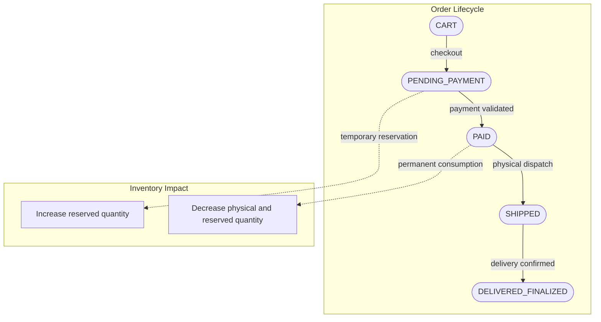

# 🛒 NexusMarket: Centralized E-Commerce Platform

Welcome to the main repository of **NexusMarket**. This platform acts as an advanced commercial intermediary between buyers and sellers, comprehensively managing the entire lifecycle of an e-commerce operation: catalog, multi-warehouse setup, distributed inventory, shopping carts, billing, and logistics.

---

## 🏗️ 1. Architecture and Technologies

The project is designed to be highly scalable and maintainable using **Domain-Driven Design (DDD)** and **Hexagonal Architecture (Ports and Adapters)**. This ensures that the pure business logic is completely isolated from databases, frameworks, or user interfaces.

### Tech Stack:
- **Language:** Java 17
- **Core Framework:** Spring Boot 4.1.0 (or 3.x)
- **Hybrid Persistence:** Spring Data JPA (MySQL) for ACID transactions and Spring Data MongoDB for flexible models or high volume (e.g., Auditing or logs).
- **Core Tools:** Lombok (boilerplate reduction), Spring Security (Auth & JWT).

---

## 📂 2. Project Structure (Domain Layer)

Currently, the project has its **Core Domain** 100% implemented under the `application.domain` base package.

```text
src/main/java/application/
└── domain/
    ├── exception/                    # 🚨 Isolated business exceptions
    │   └── DomainException.java      
    ├── model/
    │   ├── aggregate/                # 📦 Aggregate Roots
    │   │   └── Order.java            # Controls cart and order lifecycle
    │   ├── entity/                   # 🧍 Entities with own Identity
    │   │   ├── User.java             # Core authentication identity
    │   │   ├── BuyerProfile.java     # Buyer management (addresses)
    │   │   ├── SellerProfile.java    # Seller management (storefront)
    │   │   ├── Product.java          # Catalog (physical/digital, variants)
    │   │   ├── Warehouse.java        # Marketplace or Seller warehouses
    │   │   ├── InventoryItem.java    # Stock, reservations, and damaged tracking
    │   │   └── OrderItem.java        # Individual items within an Order
    │   └── valueobject/              # 🏷️ Immutable Value Objects and Enums
    │       ├── Money.java            # Safe money and currency calculations
    │       ├── Sku.java, Email.java, StockLocation.java
    │       ├── UserRole.java         # BUYER, SELLER, LOGISTICS_OPERATOR, ADMIN, SUPERVISOR
    │       ├── OrderStatus.java      # Strict order states
    │       ├── ProductType.java      # PHYSICAL vs DIGITAL
    │       └── WarehouseType.java    
    └── service/                      # ⚙️ Domain Services (Orchestrated Logic)
        ├── InventoryDomainService.java
        └── OrderFulfillmentDomainService.java
```

> **Note:** Each domain folder has detailed documentation in the root `SDD/` (Software Design Document) folder.

---

## 🔄 3. Business Operational Flow

The design strictly adheres to the **Functional Specification**, ensuring that state changes and inventory reservations occur under safe rules.



### Implemented Critical Domain Validations:
1. **Damaged Stock Management**: Units marked as damaged (`damagedQuantity`) in `InventoryItem` can never be reserved or added to the available stock (`getAvailableQuantity()`).
2. **Atomic Reservation**: The `InventoryDomainService` securely handles stock reservations across multiple warehouses simultaneously. If even one unit of a SKU is missing, the entire transaction is rejected.
3. **Order Consistency**: An order in `CART` status cannot proceed to payment (`PENDING_PAYMENT`) without a registered shipping address or if the cart is empty.
4. **Digital vs. Physical Products**: Clear distinction at the base level (`ProductType`) to adapt traditional logistics accordingly.

---

## 🚀 4. Next Implementation Steps

We have completed **Phase 1 (Setup)** and **Phase 2 (Domain Modeling)**. The next milestones to develop in this repository are:

- [ ] **Milestone 3: Authentication, Ports, and Adapters**:
  - Creation of Use Cases (Application Services) in `application.usecase`.
  - Definition of interfaces (`InputPort`, `OutputPort`).
  - Implementation of REST controllers (`adapter.in.web`) to connect Frontends.
  - Implementation of MongoDB/MySQL Repositories (`adapter.out.persistence`).
  - Configuration of JWT Filter and Spring Security roles.
- [ ] **Milestone 4: Catalog Module and Distributed Inventory**.
- [ ] **Milestone 5: Cart Engine and Concurrent Orders**.
- [ ] **Milestone 6: Billing and Post-Sale Logistics**.

---
*Document generated and maintained for NexusMarket's architectural traceability.*
