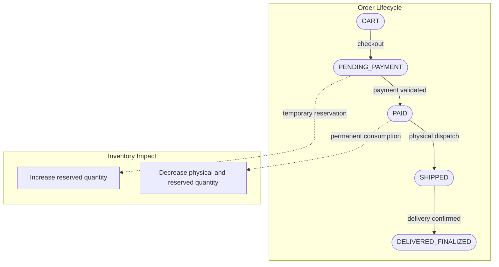

# 🛒 NexusMarket: Centralized E-Commerce Platform

Welcome to the main repository of **NexusMarket**. This platform acts as an advanced commercial intermediary between buyers and sellers, comprehensively managing the entire lifecycle of an e-commerce operation: catalog, multi-warehouse setup, distributed inventory, shopping carts, billing, and logistics.

---

## 🏗️ 1. Architecture and Technologies

The project is designed to be highly scalable and maintainable using **Domain-Driven Design (DDD)** and **Hexagonal Architecture (Ports and Adapters)**. This ensures that the pure business logic is completely isolated from databases, frameworks, or user interfaces.

### Tech Stack:
- **Language:** Java 17
- **Core Framework:** Spring Boot 4.1.0 (or 3.x)
- **Hybrid Persistence:** Spring Data JPA (MySQL) for ACID transactions and Spring Data MongoDB for flexible models or high volume (e.g., Auditing or logs).
- **Core Tools:** Lombok (boilerplate reduction), Spring Security (Auth & JWT).

---

## 📂 2. Project Structure (Domain, Application & Adapters)

Currently, the project has completely finished the **Domain**, **Application**, and **Infrastructure (Adapters)** for the User Registration and Product Catalog milestones.

```text
src/main/java/application/
├── domain/                           # 🧠 Core Business Logic (100% Complete)
│   ├── exception/, model/, service/  
├── port/                             # 🔌 Hexagonal Ports (Interfaces)
│   ├── in/                           # Input Ports (ManageProductUseCase, etc.)
│   └── out/                          # Output Ports (ProductRepositoryPort, etc.)
├── usecase/                          # 🚀 Application Services
│   ├── RegisterUserService.java      
│   └── ProductCatalogService.java    # Catalog management logic
├── adapter/                          # 🌐 Infrastructure Layer
│   ├── in/web/                       # REST Controllers & DTOs
│   │   ├── AuthController.java
│   │   ├── ProductController.java    # Catalog endpoints
│   │   └── dto/ApiResponse.java
│   └── out/persistence/              # Database JPA Repositories & Entities
│       ├── entity/                   # UserJpaEntity, ProductJpaEntity...
│       ├── repository/               # JpaRepositories
│       ├── mapper/                   # Mappers (Domain <-> JPA)
│       └── adapter/                  # Persistence Adapters
└── config/                           # ⚙️ Security and Framework Configuration
    └── SecurityConfig.java
```

> **Note:** Each architectural layer has detailed documentation in the root `SDD/` (Software Design Document) folder.

---

## 🔄 3. Business Operational Flow

The design strictly adheres to the **Functional Specification**, ensuring that state changes and inventory reservations occur under safe rules.


```mermaid
flowchart TD
    subgraph OrderLifecycle [Order Lifecycle]
        A([CART]) -->|checkout| B([PENDING_PAYMENT])
        B -->|payment validated| C([PAID])
        C -->|physical dispatch| D([SHIPPED])
        D -->|delivery confirmed| E([DELIVERED_FINALIZED])
    end

    subgraph InventoryImpact [Inventory Impact]
        B -.->|temporary reservation| R[Increase reserved quantity]
        C -.->|permanent consumption| C2[Decrease physical and reserved quantity]
    end
```

### Implemented Critical Domain Validations:
1. **Damaged Stock Management**: Units marked as damaged (`damagedQuantity`) in `InventoryItem` can never be reserved or added to the available stock.
2. **Atomic Reservation**: The `InventoryDomainService` securely handles stock reservations across multiple warehouses simultaneously.
3. **Order Consistency**: An order in `CART` status cannot proceed to payment without a registered shipping address.
4. **Digital vs. Physical Products**: Clear distinction (`ProductType`) strictly mapped to database constraints.

---

## 🚀 4. Implementation Steps & Milestones

- [x] **Milestone 1: Base Setup** (COMPLETED)
- [x] **Milestone 2: Core Domain Modeling** (COMPLETED)
- [x] **Milestone 3: Authentication, Ports, and Adapters** (COMPLETED)
- [x] **Milestone 4: Catalog Module and Distributed Inventory (COMPLETED)**:
  - [x] Product Application Services (`ProductCatalogService`).
  - [x] Persistence Adapters, Mappers, and JPA Entities (`ProductJpaEntity`).
  - [x] Web REST Controllers (`ProductController`).
- [ ] **Milestone 5: Cart Engine and Concurrent Orders**.
- [ ] **Milestone 6: Billing and Post-Sale Logistics**.

---
*Document generated and maintained for NexusMarket's architectural traceability.*
